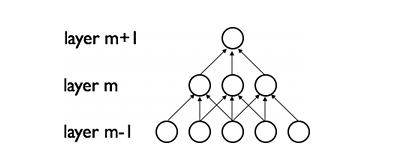
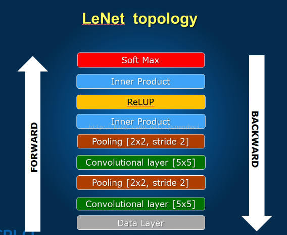
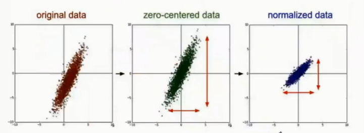
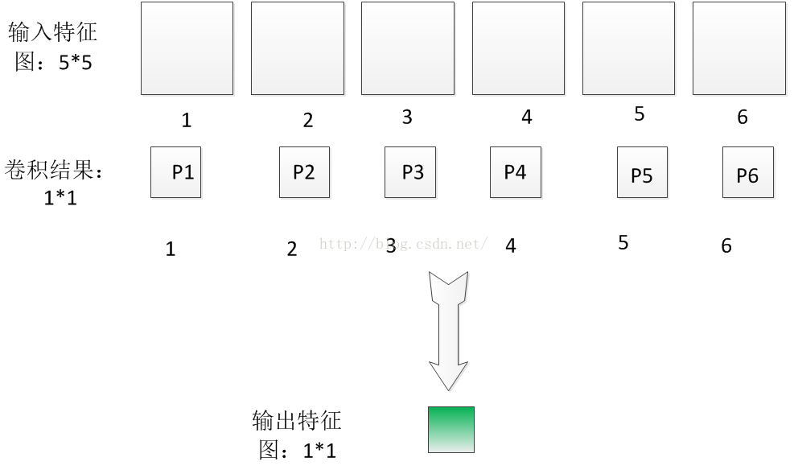

# 卷积神经网络LeNet

* [卷积网络原理](#卷积网络原理)
* [LeNet解析](#LeNet解析)
* [代码实战](#代码实战)
  * [网上的代码](#网上的代码)
  * [LeNet的MATLAB版本解读](#LeNet的MATLAB版本解读)

# 卷积网络原理

## 动机

卷积神经网络（CNN）是多层感知机（MLP）的一个变种模型，它是从生物学概念中演化而来的。从Hubel和Wiesel早期对猫的视觉皮层的研究工作，我们知道在视觉皮层存在一种细胞的复杂分布，，这些细胞对于外界的输入局部是很敏感的，它们被称为“感受野”（细胞），它们以某种方法来覆盖整个视觉域。这些细胞就像一些滤波器一样，它们对输入的图像是局部敏感的，因此能够更好地挖掘出自然图像中的目标的空间关系信息。

此外，视觉皮层存在两类相关的细胞，S细胞（Simple Cell）和C（Complex Cell）细胞。S细胞在自身的感受野内最大限度地对图像中类似边缘模式的刺激做出响应，而C细胞具有更大的感受野，它可以对图像中产生刺激的模式的空间位置进行精准地定位。

视觉皮层作为目前已知的最为强大的视觉系统，广受关注。学术领域出现了很多基于它的神经启发式模型。比如：NeoCognitron [Fukushima], HMAX [Serre07] 以及本教程要讨论的重点 LeNet-5 [LeCun98]。

## 稀疏连接

CNNs通过加强神经网络中相邻层之间节点的局部连接模式（Local Connectivity Pattern）来挖掘自然图像（中的兴趣目标）的空间局部关联信息。第m层隐层的节点与第m-1层的节点的局部子集，并具有空间连续视觉感受野的节点（就是m-1层节点中的一部分，这部分节点在m-1层都是相邻的）相连。可以用下面的图来表示这种连接。

 

假设，m-1层为视网膜输入层（接受自然图像）。根据上图的描述，在m-1层上面的m层的神经元节点都具有宽度为3的感受野，m层每一个节点连接下面的视网膜层的3个相邻的节点。m+1层的节点与它下面一层的节点有着相似的连接属性，所以m+1层的节点仍与m层中3个相邻的节点相连，但是对于输入层（视网膜层）连接数就变多了，在本图中是5。这种结构把训练好的滤波器（corresponding to the input producing the strongest response）构建成了一种空间局部模式（因为每个上层节点都只对感受野中的，连接的局部的下层节点有响应）。根据上面图，多层堆积形成了滤波器（不再是线性的了），它也变得更具有全局性了（如包含了一大片的像素空间）。比如，在上图中，第m+1层能够对宽度为5的非线性特征进行编码（就像素空间而言）。

## 权值共享

在CNNs中，每一个稀疏滤波器hi在整个感受野中是重复叠加的，这些重复的节点形式了一种特征图（feature map）,这个特种图可以共享相同的参数，比如相同的权值矩阵和偏置向量。 

在上图中，属于同一个特征图的三个隐层节点，因为需要共享相同颜色的权重, 他们的被限制成相同的。在这里， 梯度下降算法仍然可以用来训练这些共享的参数，只需要在原算法的基础上稍作改动即可。共享权重的梯度可以对共享参数的梯度进行简单的求和得到。

## 核心思想

总之，卷积网络的核心思想是将：局部感受野、权值共享（或者权值复制）以及时间或空间亚采样这三种结构思想结合起来获得了某种程度的位移、尺度、形变不变性。

# LeNet解析

上面这些内容，基本就是CNN的精髓所在了，下面结合LeNet做具体的分析。

LeNet-5是用于手写字体的识别的一个经典CNN。  LeNet-5是一种典型的用来识别数字的卷积网络（[效果和paper等见这](http://yann.lecun.com/exdb/lenet/index.html)）。当年美国大多数银行就是用它来识别支票上面的手写数字的。能够达到这种商用的地步，它的准确性可想而知。

## LeNet结构图

详细结构图请看：http://scs.ryerson.ca/~aharley/vis/conv/

**输入：**32x32的手写字体图片，这些手写字体包含0~9数字，也就是相当于10个类别的图片

**输出：**分类结果，0~9之间的一个数

因此我们可以知道，这是一个多分类问题，总共有十个类，因此神经网络的最后输出层必然是SoftMax问题，然后神经元的个数是10个。

LeNet不算输入一共为七层，下面逐层分析。 

## 第零层：数据输入层 

输入层：32*32的图片，也就是相当于1024个神经元。

CNN的强项在于图片的处理，LeNet的输入为32*32的矩阵图片。

这里需要注意的点： 
1、数据的归一化，这里的归一化是广义的，不一定要归到0-1，但要是相同的一个区间范围，一般我们的灰度图为0-255。 
2、数据的去均值，如果样本有非零的均值，而且与测试部分的非零均值不一致，可能就会导致识别率的下降。当然这不一定发生，我们这么做是为了增加系统的鲁棒性。 

## 第一层：卷积层c1 

C1层：paper作者选择6个特征卷积核，然后卷积核大小选择5x5，这样我们可以得到6个特征图，然后每个特征图的大小为32-5+1=28，也就是神经元的个数为6*28*28=784。

卷积层是卷积神经网络的**核心**，通过不同的卷积核，来获取图片的特征。卷积核相当于一个滤波器，不同的滤波器提取不同特征。打个比方，对于手写数字识别，某一个卷积核提取‘一’，另一个卷积核提取‘|’，所以这个数字很有可能就判定为‘7’。当然实际要比这复杂度得多，但原理大概就是这个样子。 

## 第二层：pooling层s2

S2层：这就是下采样（sample）层，也就是使用最大池化进行下采样，池化的size，选择(2,2)，也就是相当于对C1层28x28的图片，进行分块，每个块的大小为2x2，这样我们可以得到14x14个块，然后我们统计每个块中，最大的值作为下采样的新像素，因此我们可以得到S1结果为：14x14大小的图片，共有6个这样的图片。

基本每个卷积层后边都会接一个pooling层，目的是为了降维。一般都将原来的卷积层的输出矩阵大小变为原来的一半，方便后边的运算。另外，pooling层增加了系统的鲁棒性，把原来的准确描述变为了概略描述（原来矩阵大小为28*28，现在为14*14，必然有一部分信息丢失，一定程度上防止了过拟合）。 

pooling层可看作是模糊滤波器，起到二次特征提取的作用。隐层与隐层之间空间分辨率递减，而每层所含的平面数递增，这样可用于检测更多的特征信息。

## 第三层：卷积层c3 

与之前类似，在之前的特征中进一步提取特征，对原样本进行更深层次的表达。注意：这里不是全连接。这里不是全连接。这里不是全连接。X代表连接，空白代表不连。 

### c3具体操作

卷积层，这一层我们选择卷积核的大小依旧为5x5，据此我们可以得到新的图片大小为14-5+1=10，然后我们希望可以得到16张特征图。那么问题来了？这一层是最难理解的，我们知道S2包含：6张14x14大小的图片，我们希望这一层得到的结果是：16张10x10的图片。这16张图片的每一张，是通过S2的6张图片进行加权组合得到的，具体是怎么组合的呢？问题如下图所示：

为了解释这个问题，我们先从简单的开始，我现在假设输入6特征图的大小是5x5的，分别用6个5x5的卷积核进行卷积，得到6个卷积结果图片大小为1x1，如下图所示：

为了简便起见，我这里先做一些标号的定义：我们假设输入第i个特征图的各个像素值为$x_{1i}$，$x_{2i}$……$x_{25i}$，因为每个特征图有25个像素。因此第I个特征图经过5x5的图片卷积后，得到的卷积结果图片的像素值Pi可以表示成：
$$
P_i=w_{1i}\cdot x_{1i}+w_{2i}\cdot x_{2i}+...+w_{25i}\cdot x_{25i}
$$
这个是卷积公式，不解释。因此对于上面的P1~P6的计算方法，这个就是直接根据公式。然后我们把P1~P6相加起来，也就是：
$$
P=P_1+P_2+...+P_6
$$
把上面的Pi的计算公式，代入上式，那么我们可以得到：
$$
P=W\cdot X
$$
其中X就是输入的那6张5x5特征图片的各个像素点值，而W就是我们需要学习的参数，也就相当于6个5x5的卷积核，当然它包含着6x（5x5）个参数。因此我们的输出特征图就是：
$$
Out=f(P+b)=f(W\cdot X+b)
$$
这个就是从S2到C3的计算方法，其中b表示偏置项，f为激活函数。

我们回归到原来的问题：有6张输入14x14的特征图片，我们希望用5x5的卷积核，然后最后我们希望得到一张10x10的输出特征图片？

根据上面的过程，也就是其实我们用5x5的卷积核去卷积每一张输入的特征图，当然每张特征图的卷积核参数是不一样的，也就是不共享，因此我们就相当于需要6x(5x5)个参数。对每一张输入特征图进行卷积后，我们得到6张10x10，新图片，这个时候，我们把这6张图片相加在一起，然后加一个偏置项b，然后用激活函数进行映射，就可以得到一张10x10的输出特征图了。

而我们希望得到16张10x10的输出特征图，因此我们就需要卷积参数个数为16x(6x(5x5))=16x6x(5x5)个参数。总之，C3层每个图片是通过S2图片进行卷积后，然后相加，并且加上偏置b,最后在进行激活函数映射得到的结果。

### c3为什么不是全连接

C3层也是一个卷积层，它同样通过5x5的卷积核去卷积层S2，然后得到的特征map就只有10x10个神经元，但是它有16种不同的卷积核，所以就存在16个特征map了。这里需要注意的一点是：C3中的每个特征map是连接到S2中的**所有6个或者几个**特征map的，表示本层的特征map是上一层提取到的特征map的不同组合（这个做法也并不是唯一的）。（看到没有，这里是组合，就像之前聊到的人的视觉系统一样，底层的结构构成上层更抽象的结构，例如边缘构成形状或者目标的部分）。

刚才说C3中每个特征图由S2中所有6个或者几个特征map组合而成。**为什么不把S2中的每个特征图连接到每个C3的特征图呢？**原因有2点。第一，不完全的连接机制将连接的数量保持在合理的范围内。第二，也是最重要的，其破坏了网络的对称性。由于不同的特征图有不同的输入，所以迫使他们抽取不同的特征（希望是互补的）。

例如，存在的一个方式是：C3的前6个特征图以S2中3个相邻的特征图子集为输入。接下来6个特征图以S2中4个相邻特征图子集为输入。然后的3个以不相邻的4个特征图子集为输入。最后一个将S2中所有特征图为输入。这样C3层有1516个可训练参数和151600个连接。

## 第四层：pooling层 

与之前类似。 

**S4层：**下采样层，比较简单，也是知己对C3的16张10x10的图片进行最大池化，池化块的大小为2x2。因此最后S4层为16张大小为5x5的图片。至此我们的神经元个数已经减少为：16x5x5=400。

## 第五层：卷积层（全连接）

这里有120个卷积核，**这里是全连接的**。将矩阵卷积成一个数，方便后边网络进行判定。 

**C5层：**我们继续用5x5的卷积核进行卷积，然后我们希望得到120个特征图。这样C5层图片的大小为5-5+1=1，也就是相当于1个神经元，120个特征图，因此最后只剩下120个神经元了。这个时候，神经元的个数已经够少的了，后面我们就可以直接利用全连接神经网络，进行这120个神经元的后续处理，后面具体要怎么搞，只要懂多层感知器的都懂了，不解释。

C5层是一个卷积层，有120个特征图。每个单元与S4层的全部16个单元的5x5邻域相连。由于S4层特征图的大小也为5x5（同滤波器一样），故C5特征图的大小为1x1：这构成了S4和C5之间的全连接。之所以仍将C5标示为卷积层而非全相联层，是因为如果LeNet-5的输入变大，而其他的保持不变，那么此时特征图的维数就会比1x1大。C5层有48120个可训练连接。

## 第六层：全连接层 

和MLP中的隐层一样，获得高维空间数据的表达。 

F6层有84个单元（之所以选这个数字的原因来自于输出层的设计），与C5层全相连。有10164个可训练参数。如同经典神经网络，F6层计算输入向量和权重向量之间的点积，再加上一个偏置。然后将其传递给sigmoid函数产生单元i的一个状态。

## 第七层：输出层

这里一般采用RBF网络，每个RBF的中心为每个类别的标志，网络输出越大，代表越不相似，输出的最小值即为网络的判别结果。 

最后，输出层由欧式径向基函数（Euclidean Radial Basis Function）单元组成，每类一个单元，每个有84个输入。换句话说，每个输出RBF单元计算输入向量和参数向量之间的欧式距离。输入离参数向量越远，RBF输出的越大。一个RBF输出可以被理解为衡量输入模式和与RBF相关联类的一个模型的匹配程度的惩罚项。用概率术语来说，RBF输出可以被理解为F6层配置空间的高斯分布的负log-likelihood。给定一个输入模式，损失函数应能使得F6的配置与RBF参数向量（即模式的期望分类）足够接近。这些单元的参数是人工选取并保持固定的（至少初始时候如此）。这些参数向量的成分被设为-1或1。虽然这些参数可以以-1和1等概率的方式任选，或者构成一个纠错码，但是被设计成一个相应字符类的7*12大小（即84）的格式化图片。这种表示对识别单独的数字不是很有用，但是对识别可打印ASCII集中的字符串很有用。

使用这种分布编码而非更常用的“1 of N”编码用于产生输出的另一个原因是，当类别比较大的时候，非分布编码的效果比较差。原因是大多数时间非分布编码的输出必须为0。这使得用sigmoid单元很难实现。另一个原因是分类器不仅用于识别字母，也用于拒绝非字母。使用分布编码的RBF更适合该目标。因为与sigmoid不同，他们在输入空间的较好限制的区域内兴奋，而非典型模式更容易落到外边。

RBF参数向量起着F6层目标向量的角色。需要指出这些向量的成分是+1或-1，这正好在F6 sigmoid的范围内，因此可以防止sigmoid函数饱和。实际上，+1和-1是sigmoid函数的最大弯曲的点处。这使得F6单元运行在最大非线性范围内。必须避免sigmoid函数的饱和，因为这将会导致损失函数较慢的收敛和病态问题。

## 总结

上面的结构，只是一种参考，在现实使用中，每一层特征图需要多少个，卷积核大小选择，还有池化的时候采样率要多少，等这些都是变化的，这就是所谓的CNN调参，我们需要学会灵活多变。

比如我们可以把上面的结构改为:C1层卷积核大小为7x7，然后把C3层卷积核大小改为3x3等，然后特征图的个数也是自己选，说不定得到手写字体识别的精度比上面那个还高，这也是有可能的，总之一句话：需要学会灵活多变，需要学会CNN的调参。

## LeNet所用手写数据库

[Mnist数据库](http://yann.lecun.com/exdb/mnist/)（一个公认的手写数据库）：

http://yann.lecun.com/exdb/mnist/

# 代码实战

## 网上的代码

### 理解DeepLearnToolbox中的CNN代码

[代码讲解](https://blog.csdn.net/bingningning/article/details/52388974?locationNum=6&fps=1)

matlab源码：[GitHub/DeepLearnToolbox](https://github.com/rasmusbergpalm/DeepLearnToolbox)

### LeNet-5的python实现

[LeNet-5实现](https://blog.csdn.net/hjimce/article/details/47323463)

### 卷积神经网络(CNN)讲解及代码

[卷积神经网络(CNN)讲解及代码](https://blog.csdn.net/walegahaha/article/details/51603040)

 ## LeNet的MATLAB版本解读

# 参考资料

* [卷积神经网络CNN原理——结合实例matlab实现](https://blog.csdn.net/u010540396/article/details/52895074)

* [深度学习（四）卷积神经网络入门学习(1)](https://blog.csdn.net/hjimce/article/details/47323463)

"LeNet解析"一节参考了此文章。

* [Deep Learning（深度学习）学习笔记整理系列之（七）](https://blog.csdn.net/zouxy09/article/details/8781543)

"LeNet解析"一节参考了此文章。

